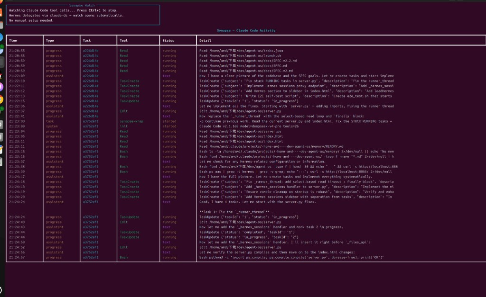

# Synapse

**See what Claude Code is doing when your orchestrator delegates to it.**

You run [Hermes](https://github.com/NousResearch/hermes-agent) (or any agent) as the brain. Claude Code writes the code. But the moment you spawn `claude-ds`, it becomes a black box — you wait 30 seconds and hope.

Synapse fixes that. Drop-in wrapper. Real-time tool calls in Discord or a terminal dashboard. Zero Docker. No LLM lock-in.

```
🧠 Hermes: "write a Flask API"
        ↓
   claude-ds  (= synapse-wrap)
        ↓
🔧 Bash mkdir …
🔧 Write src/api.py
🔧 Bash pytest
✅ DONE
```

### Hermes chat (recommended)

Set `SYNAPSE_AUTO_WATCH=0` so tool calls stream into the orchestrator — no extra terminal window:

```
[synapse] task_id=4c14525e
[Claude Code] Claude Code v2.1.168 model=deepseek-v4-pro tools=26
🔧 Read /home/amd/下载/dev/agent-os/launch.sh
🔧 Write /tmp/synapse-demo.md
🔧 Bash ls -la /tmp/synapse-demo.md
✅ DONE $0.1416 | 4 turns | 17993ms
```

### Desktop watch (optional)

Run `synapse watch` manually, or leave `SYNAPSE_AUTO_WATCH=1` to auto-open a Rich dashboard:



*Real `synapse watch` session: Read, Edit, Bash, and task progress while Hermes delegates via `claude-ds`.*

## The story

I run multiple AI agents. Hermes handles chat, memory, Discord, scheduling — it's great at *orchestrating*.

It's terrible at *coding*.

So I made a rule: **non-trivial code goes through Claude Code**, not Hermes hand-writing files. Hermes delegates with `claude-ds`. Claude Code actually runs tests, reads the repo, fixes its own mistakes.

The problem? **I couldn't see Claude Code work.**

Hermes would say "done ✅" and I'd have no idea if it ran `pytest`, wrote the wrong file, or hung for 20 seconds. Discord showed a truncated `💻 terminal: ...` and nothing else.

I built Synapse for one thing: **when the orchestrator spawns a coding agent, you see every tool call — live.**

Not another multi-agent framework. Not another memory layer. A **visibility layer** between your conductor and your coder.

## What it does

| Feature | Description |
|---------|-------------|
| **Drop-in wrapper** | Replace `claude-ds` with `synapse-wrap` — same CLI, adds visibility |
| **Discord live feed** | Each `🔧 Read` / `🔧 Write` / `🔧 Bash` posts to your active thread |
| **Hermes inline** | `🔧` lines on stdout — orchestrator chat shows every tool call |
| **Desktop watch** | Optional `synapse watch` Rich dashboard (`SYNAPSE_AUTO_WATCH=1`) |
| **Event log** | SQLite at `~/.synapse/synapse.db` — cross-process, survives restarts |

## Quick start

```bash
pip install synapse

# Replace your claude-ds launcher (example)
ln -sf "$(which synapse-wrap)" ~/.local/bin/claude-ds

# Optional: watch dashboard in another terminal
synapse watch
```

### With Hermes + Claude Code

1. Point `~/.local/bin/claude-ds` at `synapse-wrap`
2. Hermes skill already says: non-trivial tasks → `terminal("claude-ds '...'")`
3. Tool calls appear **in the Hermes conversation** (stdout) and on Discord (optional)
4. No manual setup per task

```bash
# ~/.local/bin/claude-ds
#!/bin/bash
export SYNAPSE_BIN="/path/to/synapse/.venv/bin/synapse"
export SYNAPSE_AUTO_WATCH=0   # Hermes users: see output in chat, not a popup
exec /path/to/synapse/.venv/bin/synapse-wrap "$@"
```

### Environment

| Variable | Default | Purpose |
|----------|---------|---------|
| `SYNAPSE_AUTO_WATCH` | `1` | `0` = stdout only (Hermes). `1` = also auto-open `synapse watch` |
| `SYNAPSE_DISCORD_NOTIFY` | `1` | Push tool calls to Discord (needs Hermes session env) |
| `SYNAPSE_ENV_FILE` | `~/.hermes/.env` | Env file for Claude Code + Discord bot token |
| `SYNAPSE_BIN` | auto | Path to `synapse` CLI for auto-watch |

## Architecture

```
Hermes (orchestrator)
    │  terminal("claude-ds 'task'")
    ▼
synapse-wrap
    ├── claude --output-format stream-json
    ├── parse tool calls (Read / Write / Bash …)
    ├── write events → ~/.synapse/synapse.db
    ├── push progress → Discord thread (optional)
    └── print 🔧 lines → Hermes stdout
         ▼
synapse watch  ← polls SQLite, Rich live table
```

## Commands

```bash
synapse-wrap "write a health check API"   # run Claude Code with visibility
synapse watch                             # live dashboard
synapse events tail -f --plain            # tail tool-call log
```

## Why not X?

| | Synapse | Trellis | hcom | Gas Town |
|---|---------|---------|------|----------|
| **Problem** | See delegated coder | Project harness & memory | Agent messaging | Full orchestration |
| **Scope** | One wrapper | Whole repo workflow | Cross-terminal comms | 30-agent swarm |
| **Install** | `pip install synapse` | npm global | pip / cargo | brew + beads ecosystem |

Synapse complements Trellis: Trellis is vertical (specs, memory per repo). Synapse is horizontal (what's the coder doing *right now*).

## Requirements

- Python 3.10+
- [Claude Code CLI](https://code.claude.com/) (or your `claude-ds` wrapper)
- Optional: Hermes gateway for Discord push (reads `HERMES_SESSION_THREAD_ID`)

## Author

**Ethan Yeang** — built because Hermes codes badly and Claude Code codes well, but nobody showed me the middle.

## License

MIT

---

## 中文

**Synapse = 看穿「主 Agent 委派 Claude Code 写代码」时的黑箱。**

我用 Hermes 当大脑：聊天、记忆、Discord 都行。但让它自己写代码，质量不行。所以铁律是：**复杂代码一律走 `claude-ds`（Claude Code）**。

问题是委派出去就看不见了——Discord 只显示 `💻 terminal: ...`，不知道是在读文件、写代码还是卡死了。

Synapse 做一件事：每次 `claude-ds` 跑的时候，**实时把每一步 tool call 显示在 Hermes 对话里**（也可推 Discord / 开 `synapse watch`）。

Hermes 推荐配置：`export SYNAPSE_AUTO_WATCH=0`（不弹窗，输出直接在聊天里）。

```
🔧 Read launch.sh
🔧 Write /tmp/synapse-demo.md
🔧 Bash ls -la /tmp/synapse-demo.md
✅ DONE $0.1416 | 4 turns | 17993ms
```

可选桌面面板：`synapse watch`（见 `assets/synapse-watch-demo.png`）。

安装：`pip install synapse`，把 `claude-ds` 指到 `synapse-wrap`，完事。
